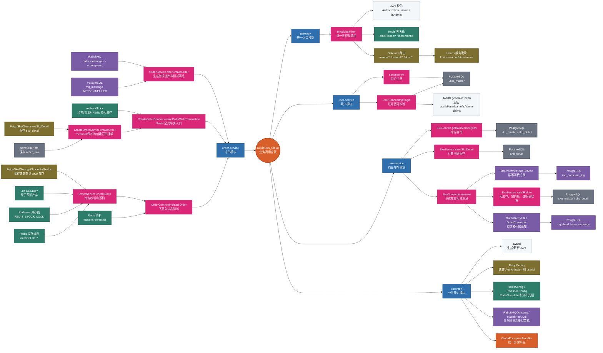

# DuJiaCun_Cloud 调用链路与中间件配置分析

本文档基于当前仓库的 Gradle 模块、YAML 配置、Controller/Service/Feign/MQ Listener 和 MyBatis Mapper 进行整理，目标是让新人快速理解项目流程，让熟悉项目的人可以按配置继续深入分析。

## 快速阅读顺序

1. 先看“项目总览”，建立模块和数据边界。
2. 再看“核心调用链路”，理解下单主流程。
3. 继续看“模块接口矩阵”，定位接口、方法和数据表。
4. 最后按中间件章节查配置和可复制代码片段。
## 1. 项目总览

| 模块 | 职责 | 端口/服务名 | 入口与调用 | 关键依赖 | 主要数据/状态 |
| --- | --- | --- | --- | --- | --- |
| gateway | 统一入口、路由、CORS、JWT 校验、黑名单校验、请求 ID 生成 | 12345 / gateway | `/users/**` -> user-service；`/orders/**` -> order-service；`/skus/**` -> sku-service | Spring Cloud Gateway、Nacos Discovery、Redis、common | `Authorization`、`isAdmin`、`name=dujiacun`、`userId`、`incrementId` |
| user-service | 用户注册、登录、用户信息查询、JWT 生成 | 8080 / user-service | `/users/login`、`/users/register`、`/users/{userId}` | Spring MVC、Nacos、MyBatis、PostgreSQL、Redis、common | `user_master`、`is_admin`、JWT claims |
| order-service | 下单编排、Redis 预扣库存、Seata 全局事务、订单落库、MQ 投递 | 9080 / order-service | `/orders/orderInfo`、`/orders/orderInfoByUserId`、`/orders/{orderId}` | OpenFeign、Redis/Redisson、Seata、Sentinel、RabbitMQ、MyBatis | `order_info`、`mq_message`、`sku:*`、`incr:*` |
| sku-service | 商品查询、订单明细保存、MQ 消费扣减库存、死信记录 | 7070 / sku-service | `/skus/skuList`、`/skus/skuStocksByIds`、`/skus/skuDetail`、MQ listeners | RabbitMQ、Seata、MyBatis、PostgreSQL、Redisson、common | `sku_master`、`sku_detail`、`mq_consume_log`、`mq_dead_letter_message` |
| common | 公共返回体、异常处理、JWT、Redis/Redisson、Feign 请求头透传、线程上下文、常量 | library | 被 gateway/user/order/sku 依赖 | Spring Web、Validation、AMQP、Redis、Redisson、OpenFeign、JJWT | `UserThreadLocal`、`RabbitMQConstant`、`SysConstant` |

## 2. 核心调用链路

### 2.1 业务执行流程图

##### 阅读顺序

- **入口与鉴权**：调用方先进入 `gateway`，登录/注册直接放行，其余请求校验 `Authorization`、`blackToken:*`、`name=dujiacun`，解析 JWT 后透传 `userId` 和 `incrementId`。
- **下单主链路**：`OrderController.createOrder` 做 Redis 防重复提交，再由 `OrderServiceImpl.checkStock` 查询/补齐库存缓存，并在 Redisson 锁内用 Lua 原子预扣 Redis 库存。
- **订单创建事务**：`CreateOrderServiceImpl.createOrderWithTransaction` 开启 Seata 全局事务，`createOrder` 受 Sentinel 保护，事务内保存 `order_info` 并通过 Feign 调用 `SkuServiceImpl.saveSkuDetail` 保存 `sku_detail`。
- **事务成功后的异步链路**：`OrderServiceImpl.afterCreateOrder` 先写 `mq_message=INIT`，再投递 RabbitMQ；生产者 confirm/returns 回调把消息状态更新为 `SENT` 或 `FAILED`。
- **库存最终扣减**：`SkuConsumer.receive` 监听 `order.queue`，`MqOrderMessageService.consumeOrderStockDeduct` 先写幂等消费日志，再调用 `SkuServiceImpl.saleSkuInfo` 扣减 `sku_master` 并更新 `sku_detail` 状态。
- **异常补偿路径**：创建订单或 Sentinel 降级抛异常时回滚 Redis 预扣库存；消费异常时通过 `RabbitRetryUtil` 重试，超过 3 次后 `basicReject` 进入死信队列并由 `DeadConsumer.receive` 落库。

##### 模块边界与治理范围

- **gateway**：负责统一入口、JWT/黑名单校验、请求上下文生成和服务路由。
- **user-service**：负责登录、注册、用户信息读取和 JWT 生成，是鉴权链路的数据来源。
- **order-service**：负责下单编排、Redis 预扣、Seata/Sentinel 治理、订单落库和 MQ 生产。
- **sku-service**：负责库存读取、订单明细落库、MQ 消费扣减、消费幂等和死信记录。
- **common**：提供 `JwtUtil`、`TokenFilter`、`FeignConfig`、Redis/Redisson 配置、RabbitMQ 常量和重试工具，通过虚线表示被各服务复用。

```mermaid
%%{init: {"flowchart": {"htmlLabels": true, "nodeSpacing": 34, "rankSpacing": 46, "curve": "basis"}, "themeVariables": {"fontSize": "14px", "edgeLabelBackground": "transparent"}, "themeCSS": ".edgeLabel,.edgeLabel span,.edgeLabel p,.edgeLabel div,.edgeLabel foreignObject{background-color:transparent!important;font-size:17px!important;font-weight:700!important}.edgeLabel .labelBkg,.edgeLabel rect{fill:transparent!important;stroke:transparent!important;opacity:0!important}"}}%%
flowchart TB
  classDef title fill:#FFFFFF,stroke-width:0px,color:#111827,font-size:22px,font-weight:bold
  classDef caller fill:#F8FAFC,color:#1F2937,stroke:#CBD5E1,stroke-width:1.5px
  classDef gateway fill:#EAF3FF,color:#123A5F,stroke:#4B83B8,stroke-width:1.8px
  classDef user fill:#EEF2FF,color:#27346B,stroke:#6675C8,stroke-width:1.8px
  classDef order fill:#FFF2E8,color:#7A2E13,stroke:#E8793C,stroke-width:1.8px
  classDef sku fill:#EAF7F4,color:#14564A,stroke:#3D9B87,stroke-width:1.8px
  classDef redis fill:#EAF8EE,color:#14532D,stroke:#44A36F,stroke-width:1.8px
  classDef mq fill:#F3EEFF,color:#49306B,stroke:#8B6BC0,stroke-width:1.8px
  classDef db fill:#F4F5F7,color:#374151,stroke:#8B95A1,stroke-width:1.8px
  classDef common fill:#FFF9E6,color:#5C4813,stroke:#B89B31,stroke-width:1.5px,stroke-dasharray:5 4
  classDef warn fill:#FFF1F1,color:#8A1C1C,stroke:#D14343,stroke-width:2px
  classDef gov fill:#FFFBEA,color:#5C4813,stroke:#C9A227,stroke-width:2px

  subgraph PAGE_STACK[" "]
    direction TB
    subgraph MAIN_ROW[" "]
      direction LR
      subgraph TOP_STACK[" "]
        direction TB
        subgraph TOP_ROW[" "]
          direction LR
          subgraph COMMON[" "]
            direction TB
            CommonTitle["common 模块<br/><b>公共能力复用</b>"]
            CommonNode["JwtUtil / TokenFilter / FeignConfig<br/>RedisConfig / RedissonConfig / RabbitRetryUtil / 常量"]
          end

          subgraph APP_ENTRY_STACK[" "]
            direction TB
            subgraph CALLER[" "]
              direction TB
              CallerTitle["调用方<br/><b>HTTP 请求入口</b>"]
              Client["前端/外部调用方<br/>携带 token、name、isAdmin"]
            end

            subgraph GATEWAY[" "]
              direction TB
              GatewayTitle["gateway 模块<br/><b>统一入口 / 鉴权 / 路由</b>"]
              subgraph GATEWAY_BODY[" "]
                direction LR
                subgraph GATEWAY_ENTRY[" "]
                  direction TB
                  GatewayFilter["MyGlobalFilter.filter<br/>统一拦截请求"]
                  LoginBypass["放行 /users/login /users/register<br/>登录注册不校验 token"]
                end
                subgraph AUTH_GOV[" "]
                  direction TB
                  AuthTitle["鉴权治理范围<br/><b>JWT + 黑名单 + 请求上下文</b>"]
                  GatewayAuth["校验请求头与参数<br/>Authorization、isAdmin、name=dujiacun"]
                  RedisBlackToken["Redis<br/>blackToken:* 黑名单校验<br/>incrementId 自增"]
                  JwtParse["JwtUtil.parseToken<br/>解析 userId/userName/isAdmin"]
                  TokenFilter["TokenFilter.doFilter<br/>写入 UserThreadLocal"]
                  RejectResponse["401/403 响应<br/>认证失败或权限不足"]
                end
              end
            end

            subgraph USER[" "]
              direction TB
              UserTitle["user-service 模块<br/><b>用户登录 / 注册 / JWT 生成</b>"]
              subgraph USER_BODY[" "]
                direction LR
                subgraph USER_SERVICE_FLOW[" "]
                  direction TB
                  UserLogin["UserServiceImpl.login<br/>校验账号密码"]
                  UserMapperByName["UserMapper.getByUserName<br/>按用户名查询用户"]
                  JwtGenerate["JwtUtil.generateToken<br/>生成登录 token"]
                  UserRegister["UserServiceImpl.setUserInfo<br/>注册用户并设置 isAdmin=0"]
                end
                subgraph USER_DB[" "]
                  direction TB
                  UserDbTitle["user-service 数据访问<br/><b>PostgreSQL / MyBatis</b>"]
                  UserMaster["user_master<br/>用户账号、密码、角色"]
                end
              end
            end
          end
        end
      end

    subgraph ORDER[" "]
      direction TB
      OrderTitle["order-service 模块<br/><b>下单编排 / 预扣 / 事务 / MQ 生产</b>"]
      subgraph ORDER_ENTRY_ROW[" "]
        direction LR
        OrderCreate["OrderController.createOrder<br/>接收下单 DTO 并编排主流程"]
        Debounce["Redis setIfAbsent<br/>incr:{incrementId} 3 秒防重复提交"]
      end

      subgraph ORDER_CORE_ROW[" "]
        direction LR
        subgraph STOCK_LOCK_GOV[" "]
          direction TB
          StockLockTitle["分布式锁治理范围<br/><b>REDIS_STOCK_LOCK</b>"]
          CheckStock["OrderServiceImpl.checkStock<br/>校验库存并准备预扣"]
          RedisMultiGet["Redis multiGet<br/>读取 sku:* 库存缓存"]
          DbToRedis["OrderServiceImpl.dbTORedis<br/>缓存缺失时从 DB 回填"]
          FeignGetStock["FeignSkuClient.getStocksBySkuIds<br/>库存缓存回源查询"]
          RedisFill["Redis multiSetIfAbsent<br/>写入缺失 sku:* 缓存"]
          StockLock["Redisson.tryLock<br/>获取库存预扣锁"]
          LuaDeduct["Redis Lua DECRBY<br/>批量原子预扣库存"]
          StockFail["库存不足<br/>返回预扣失败"]
        end

        subgraph SEATA_GOV[" "]
          direction TB
          SeataTitle["Seata 全局事务背景<br/><b>@GlobalTransactional</b>"]
          TxStart["CreateOrderServiceImpl.createOrderWithTransaction<br/>开启订单创建事务"]
          subgraph SENTINEL_GOV[" "]
            direction TB
            SentinelTitle["Sentinel 保护范围<br/><b>资源名 createOrder</b>"]
            SentinelCreate["CreateOrderServiceImpl.createOrder<br/>生成订单号、计算金额、保存订单与明细"]
            SentinelBlock["handleDeductStockBlock / fallbackDeductStock<br/>限流、熔断或业务异常降级"]
          end
          SaveOrderInfo["OrderServiceImpl.saveOrderInfo<br/>保存 order_info 待支付订单"]
          FeignSaveDetail["FeignSkuClient.saveSkuDetail<br/>远程保存订单明细"]
        end
      end

      subgraph ORDER_RECOVERY_ROW[" "]
        direction LR
        subgraph ROLLBACK_GOV[" "]
          direction TB
          RollbackTitle["异常补偿治理范围<br/><b>REDIS_ROLL_BACK_LOCK</b>"]
          RollbackStock["OrderServiceImpl.rollbackStock<br/>创建失败时回滚 Redis 预扣"]
          RollbackLock["Redisson.tryLock<br/>获取回滚锁"]
          LuaRollback["Redis Lua INCRBY<br/>批量归还库存"]
          RedisRestore["Redis sku:*<br/>恢复预扣库存"]
        end

        subgraph ORDER_DB[" "]
          direction TB
          OrderDbTitle["order-service 数据访问<br/><b>PostgreSQL / MyBatis</b>"]
          OrderInfoTable["order_info<br/>订单主表，待支付状态"]
          MqMessageInit["mq_message<br/>INIT：待发送"]
          MqMessageSent["mq_message<br/>SENT：到达交换机"]
          MqMessageFailed["mq_message<br/>FAILED：发送或路由失败"]
        end
      end

      subgraph ORDER_ASYNC_ROW[" "]
        direction LR
        AfterCreateOrder["OrderServiceImpl.afterCreateOrder<br/>事务成功后记录并投递库存扣减消息"]
        InsertMqMessage["MqMessageMapper.insertMessage<br/>写生产端消息记录"]
        RabbitPublish["RabbitTemplate.convertAndSend<br/>发布 ORDER_STOCK_DEDUCT 消息"]
        ConfirmCallback["RabbitTemplateConfig.confirm<br/>交换机确认回调"]
        ReturnCallback["RabbitTemplateConfig.returned<br/>路由失败回调"]
      end
    end

      subgraph BOTTOM_STACK[" "]
        direction LR
        subgraph SKU[" "]
          direction TB
          SkuTitle["sku-service 模块<br/><b>库存查询 / 明细保存 / 消费扣减</b>"]
          subgraph SKU_FLOW_ROW[" "]
            direction LR
            SkuGetStock["SkuServiceImpl.getSkuStocksByIds<br/>按 skuId 批量查询库存"]
            subgraph SKU_DETAIL_TX[" "]
              direction TB
              SkuDetailTitle["本地事务背景<br/><b>@Transactional saveSkuDetail</b>"]
              SkuSaveDetail["SkuServiceImpl.saveSkuDetail<br/>保存订单商品明细为待支付"]
            end
            SkuReceive["SkuConsumer.receive<br/>监听 order.queue 并手动 ack"]
            subgraph SKU_CONSUME_TX[" "]
              direction TB
              SkuConsumeTitle["消费幂等事务背景<br/><b>@Transactional consumeOrderStockDeduct</b>"]
              ConsumeService["MqOrderMessageService.consumeOrderStockDeduct<br/>按 messageId 幂等消费"]
              InsertConsumeLog["MqConsumeLogMapper.insertIgnore<br/>插入消费成功日志，重复消息直接忽略"]
              SaleSkuInfo["SkuServiceImpl.saleSkuInfo<br/>扣 sku_master 库存并更新 sku_detail 状态"]
            end
            BasicAck["channel.basicAck<br/>确认消费成功"]
            RetryUtil["RabbitRetryUtil.retryMessage<br/>设置 retry_count 并重新入队"]
            BasicReject["channel.basicReject<br/>超过 3 次后拒绝且不重新入队"]
            DeadReceive["DeadConsumer.receive<br/>消费死信并保存失败现场"]
          end
          subgraph SKU_DB[" "]
            direction TB
            SkuDbTitle["sku-service 数据访问<br/><b>PostgreSQL / MyBatis</b>"]
            SkuMasterRead["sku_master<br/>库存缓存回源读取"]
            SkuDetailTable["sku_detail<br/>订单明细，待支付/已支付"]
            ConsumeLogTable["mq_consume_log<br/>消费幂等记录"]
            SkuStockUpdate["sku_master + sku_detail<br/>扣库存、加销量、更新明细状态"]
            DeadLetterTable["mq_dead_letter_message<br/>死信消息落库"]
          end
        end

        subgraph MQ[" "]
          direction TB
          MqTitle["RabbitMQ 中间件<br/><b>可靠投递 / 重试 / 死信</b>"]
          subgraph MQ_MAIN_ROW[" "]
            direction LR
            OrderExchange["order.exchange<br/>DirectExchange"]
            OrderQueue["order.queue<br/>绑定 order.routingKey.success<br/>配置死信交换机"]
            RepublishQueue["默认交换机重新入队<br/>等待再次消费"]
          end
          subgraph MQ_DEAD_ROW[" "]
            direction LR
            DeadExchange["dead.order.exchange<br/>DirectExchange"]
            DeadQueue["dead.order.queue<br/>保存最终失败消息"]
          end
        end
      end
    end
  end

  Client -->|<b>HTTP 请求进入网关</b>| GatewayFilter
  GatewayFilter -->|<b>登录注册放行</b>| LoginBypass
  LoginBypass -->|<b>路由 /users/**</b>| UserLogin
  GatewayFilter -->|<b>非登录请求进入鉴权</b>| GatewayAuth
  GatewayAuth -->|<b>查黑名单并生成请求ID</b>| RedisBlackToken
  GatewayAuth -->|<b>JWT 校验通过</b>| JwtParse
  JwtParse -->|<b>透传 userId / incrementId</b>| TokenFilter
  TokenFilter -->|<b>路由 /orders/**</b>| OrderCreate
  UserLogin -->|<b>查询用户</b>| UserMapperByName
  UserMapperByName -->|<b>读 user_master</b>| UserMaster
  UserLogin -->|<b>生成登录态</b>| JwtGenerate
  UserRegister -->|<b>写入新用户</b>| UserMaster
  OrderCreate -->|<b>防重复提交</b>| Debounce
  Debounce -->|<b>进入库存校验</b>| CheckStock
  CheckStock -->|<b>读取 sku:* 缓存</b>| RedisMultiGet
  RedisMultiGet -. <b>缓存缺失</b> .-> DbToRedis
  DbToRedis -->|<b>Feign 回源查库存</b>| FeignGetStock
  FeignGetStock -->|<b>/skus/skuStocksByIds</b>| SkuGetStock
  SkuGetStock -->|<b>查询库存</b>| SkuMasterRead
  DbToRedis -->|<b>写回 Redis</b>| RedisFill
  CheckStock -->|<b>按 sku 排序后加锁</b>| StockLock
  StockLock -->|<b>锁内执行预扣</b>| LuaDeduct
  LuaDeduct -->|<b>预扣成功</b>| TxStart
  TxStart -->|<b>代理调用 createOrder</b>| SentinelCreate
  SentinelCreate -->|<b>保存订单主表</b>| SaveOrderInfo
  SaveOrderInfo -->|<b>写 order_info</b>| OrderInfoTable
  SentinelCreate -->|<b>Feign 保存明细</b>| FeignSaveDetail
  FeignSaveDetail -->|<b>/skus/skuDetail</b>| SkuSaveDetail
  SkuSaveDetail -->|<b>写 sku_detail</b>| SkuDetailTable
  TxStart -. <b>异常触发补偿</b> .-> RollbackStock
  SentinelBlock -. <b>抛出业务异常</b> .-> RollbackStock
  RollbackStock -->|<b>获取回滚锁</b>| RollbackLock
  RollbackLock -->|<b>INCRBY 归还库存</b>| LuaRollback
  LuaRollback -->|<b>恢复 sku:*</b>| RedisRestore
  SentinelCreate -->|<b>事务成功后</b>| AfterCreateOrder
  AfterCreateOrder -->|<b>记录生产消息</b>| InsertMqMessage
  InsertMqMessage -->|<b>写 INIT</b>| MqMessageInit
  AfterCreateOrder -->|<b>投递库存扣减消息</b>| RabbitPublish
  RabbitPublish -->|<b>发送到交换机</b>| OrderExchange
  OrderExchange -->|<b>routingKey 路由</b>| OrderQueue
  RabbitPublish -. <b>confirm ack</b> .-> ConfirmCallback
  ConfirmCallback -->|<b>更新 SENT</b>| MqMessageSent
  RabbitPublish -. <b>return / nack</b> .-> ReturnCallback
  ReturnCallback -->|<b>更新 FAILED</b>| MqMessageFailed
  OrderQueue -->|<b>推送消息</b>| SkuReceive
  SkuReceive -->|<b>调用消费服务</b>| ConsumeService
  ConsumeService -->|<b>插入幂等日志</b>| InsertConsumeLog
  InsertConsumeLog -->|<b>写消费记录</b>| ConsumeLogTable
  ConsumeService -->|<b>首次消费才扣库存</b>| SaleSkuInfo
  SaleSkuInfo -->|<b>更新库存和明细</b>| SkuStockUpdate
  SkuReceive -->|<b>消费成功确认</b>| BasicAck
  SkuReceive -. <b>消费异常</b> .-> RetryUtil
  RetryUtil -->|<b>未超过 3 次</b>| RepublishQueue
  RepublishQueue -->|<b>重新进入队列</b>| OrderQueue
  RetryUtil -. <b>超过 3 次</b> .-> BasicReject
  BasicReject -->|<b>进入死信交换机</b>| DeadExchange
  DeadExchange -->|<b>死信路由</b>| DeadQueue
  DeadQueue -->|<b>死信消费</b>| DeadReceive
  DeadReceive -->|<b>记录失败现场</b>| DeadLetterTable
  CommonNode -. <b>JWT 工具</b> .-> JwtParse
  CommonNode -. <b>线程上下文</b> .-> TokenFilter
  CommonNode -. <b>Feign 头透传</b> .-> FeignSaveDetail
  CommonNode -. <b>MQ 常量/重试</b> .-> RetryUtil
  CommonNode -. <b>Redis/Redisson 配置</b> .-> CheckStock
  GatewayAuth -. <b>鉴权失败</b> .-> RejectResponse
  CheckStock -. <b>库存不足</b> .-> StockFail
  SentinelCreate -. <b>限流/熔断</b> .-> SentinelBlock

  class CallerTitle,GatewayTitle,AuthTitle,UserTitle,UserDbTitle,OrderTitle,OrderDbTitle,StockLockTitle,SeataTitle,SentinelTitle,RollbackTitle,SkuTitle,SkuDetailTitle,SkuConsumeTitle,SkuDbTitle,MqTitle,CommonTitle title
  class Client caller
  class GatewayFilter,LoginBypass,GatewayAuth,JwtParse,TokenFilter gateway
  class UserLogin,UserMapperByName,JwtGenerate,UserRegister user
  class OrderCreate,Debounce,CheckStock,DbToRedis,FeignGetStock,TxStart,SentinelCreate,SaveOrderInfo,FeignSaveDetail,RollbackStock,AfterCreateOrder,InsertMqMessage,RabbitPublish,ConfirmCallback,ReturnCallback order
  class SkuGetStock,SkuSaveDetail,SkuReceive,ConsumeService,InsertConsumeLog,SaleSkuInfo,BasicAck,RetryUtil,BasicReject,DeadReceive sku
  class RedisBlackToken,RedisMultiGet,RedisFill,StockLock,LuaDeduct,RollbackLock,LuaRollback,RedisRestore redis
  class OrderExchange,OrderQueue,RepublishQueue,DeadExchange,DeadQueue mq
  class UserMaster,SkuMasterRead,OrderInfoTable,SkuDetailTable,MqMessageInit,MqMessageSent,MqMessageFailed,ConsumeLogTable,SkuStockUpdate,DeadLetterTable db
  class CommonNode common
  class RejectResponse,StockFail,SentinelBlock warn

  style CALLER fill:#F8FAFC,stroke:#CBD5E1,stroke-width:2px,color:#1F2937
  style GATEWAY fill:#EEF7FF,stroke:#4B83B8,stroke-width:2px,color:#123A5F
  style AUTH_GOV fill:#F7FBFF,stroke:#2F6FAD,stroke-width:3px,color:#123A5F
  style USER fill:#F1F3FF,stroke:#6675C8,stroke-width:2px,color:#27346B
  style ORDER fill:#FFF7F0,stroke:#E8793C,stroke-width:2px,color:#7A2E13
  style STOCK_LOCK_GOV fill:#F0FBF3,stroke:#35A56A,stroke-width:3px,color:#14532D
  style SEATA_GOV fill:#FFF8E1,stroke:#C9A227,stroke-width:3px,color:#5C4813
  style SENTINEL_GOV fill:#FFF0E8,stroke:#E4572E,stroke-width:3px,color:#7A2E13
  style ROLLBACK_GOV fill:#FFF1F1,stroke:#D14343,stroke-width:3px,color:#8A1C1C
  style SKU fill:#EFFAF7,stroke:#3D9B87,stroke-width:2px,color:#14564A
  style SKU_DETAIL_TX fill:#F4FCFA,stroke:#3D9B87,stroke-width:3px,color:#14564A
  style SKU_CONSUME_TX fill:#F4FCFA,stroke:#3D9B87,stroke-width:3px,color:#14564A
  style MQ fill:#F6F1FF,stroke:#8B6BC0,stroke-width:2px,color:#49306B
  style USER_DB fill:#F7F8FA,stroke:#8B95A1,stroke-width:2px,color:#374151
  style ORDER_DB fill:#F7F8FA,stroke:#8B95A1,stroke-width:2px,color:#374151
  style SKU_DB fill:#F7F8FA,stroke:#8B95A1,stroke-width:2px,color:#374151
  style SPLIT_ROW fill:transparent,stroke:transparent,color:transparent
  style RIGHT_HALF fill:transparent,stroke:transparent,color:transparent
  style TOP_STACK fill:transparent,stroke:transparent,color:transparent
  style TOP_ROW fill:transparent,stroke:transparent,color:transparent
  style APP_ENTRY_STACK fill:transparent,stroke:transparent,color:transparent
  style BOTTOM_STACK fill:transparent,stroke:transparent,color:transparent
  style GATEWAY_BODY fill:transparent,stroke:transparent,color:transparent
  style GATEWAY_ENTRY fill:transparent,stroke:transparent,color:transparent
  style USER_BODY fill:transparent,stroke:transparent,color:transparent
  style USER_SERVICE_FLOW fill:transparent,stroke:transparent,color:transparent
  style ORDER_ENTRY_ROW fill:transparent,stroke:transparent,color:transparent
  style ORDER_CORE_ROW fill:transparent,stroke:transparent,color:transparent
  style ORDER_RECOVERY_ROW fill:transparent,stroke:transparent,color:transparent
  style ORDER_ASYNC_ROW fill:transparent,stroke:transparent,color:transparent
  style SKU_FLOW_ROW fill:transparent,stroke:transparent,color:transparent
  style MQ_MAIN_ROW fill:transparent,stroke:transparent,color:transparent
  style MQ_DEAD_ROW fill:transparent,stroke:transparent,color:transparent
  style COMMON fill:#FFF9E6,stroke:#B89B31,stroke-width:2px,color:#5C4813

  linkStyle default stroke:#9AA4B2,stroke-width:1.6px,color:#374151
  linkStyle 0,7,12,13,20,21,22,23,24,34,44,45,48,50 stroke:#E4572E,stroke-width:3px,color:#E4572E
  linkStyle 1,2,3,4,5,6,8,10 stroke:#2F6FAD,stroke-width:2.4px,color:#2F6FAD
  linkStyle 14,15,19,31,32,33,63,65 stroke:#2E7D6B,stroke-width:2.4px,color:#2E7D6B
  linkStyle 16,17,26,27,61 stroke:#2D8A8A,stroke-width:2.4px,color:#2D8A8A
  linkStyle 35,36,37,38,39,40,41,42,43,52,53,55,56,57 stroke:#7A5BA6,stroke-width:2.4px,color:#7A5BA6
  linkStyle 9,11,18,25,28,36,41,43,47,49,58 stroke:#6B7280,stroke-width:2.2px,color:#6B7280
  linkStyle 29,30,51,54,64,65,66 stroke:#C2410C,stroke-width:2.6px,stroke-dasharray:5 4,color:#C2410C
  linkStyle 59,60,61,62,63 stroke:#8A6A16,stroke-width:1.8px,stroke-dasharray:4 4,color:#8A6A16
```

### 2.2 思维导图


## 3. 模块接口矩阵

| 模块            | 类型 | 入口/方法 | 内部调用 | 中间件/外部调用 | 数据表/缓存 key | 事务/可靠性 | 备注 |
|---------------| --- | --- | --- | --- | --- | --- | --- |
| gateway       | Filter | `MyGlobalFilter` | `JwtUtil.parseToken` | Redis 黑名单、自增 `incrementId`、Gateway `lb://` 路由 | `blackToken:*`、`incrementId` | 401/403 直接终止 | `login/register` 放行；要求 query `name=dujiacun` |
| user-service  | REST | `POST /users/login` | `UserServiceImpl.login` -> `UserMapper.getByUserName` -> `JwtUtil.generateToken` | PostgreSQL、JWT | `user_master` | 业务异常统一处理 | 返回 token/tokenHeader/isAdmin |
|               | REST | `POST /users/register` | `setUserInfo` | PostgreSQL | `user_master` | 重复用户抛 `BusinessException` | 默认 `isAdmin=0` |
| order-service | REST | `POST /orders/orderInfo` | `checkStock` -> `createOrderWithTransaction` -> `afterCreateOrder` | Redis、Redisson、Feign、Seata、Sentinel、RabbitMQ | `sku:*`、`incr:*`、`order_info`、`sku_detail`、`mq_message` | 核心链路；异常回滚 Redis/DB | 核心下单入口 |
|               | Service | `checkStock` | `dbTORedis`、Lua `DECRBY` | `FeignSkuClient.getStocksBySkuIds`、Redisson lock | `sku:*` | 库存预扣原子执行 | 缓存缺失时从 sku DB 恢复 |
|               | Service | `createOrderWithTransaction` | `createOrder`、`saveOrderInfo`、`saveSkuDetail` | Seata TM、Sentinel | `order_info`、`sku_detail` | `@GlobalTransactional` | 失败时 `rollbackStock` |
|               | Service | `afterCreateOrder` | insert `mq_message`、`convertAndSend` | RabbitMQ confirm/return | `mq_message` | `INIT -> SENT/FAILED` | 当前创建订单后直接发送扣库存消息 |
| sku-service   | REST | `POST /skus/skuStocksByIds` | `getSkuStocksByIds` | PostgreSQL | `sku_master`、`sku_detail` | 无显式事务 | 给订单服务恢复 Redis 库存缓存 |
|               | REST | `POST /skus/skuDetail` | `saveSkuDetail` | PostgreSQL、Seata RM | `sku_detail` | `@Transactional` | 保存订单明细，状态待付款 |
|               | MQ | `SkuConsumer` | `consumeOrderStockDeduct` -> `saleSkuInfo` | RabbitMQ manual ACK、RetryUtil | `mq_consume_log`、`sku_master`、`sku_detail` | 幂等 + 事务 | 超过 3 次进入死信 |
|               | MQ | `DeadConsumer` | `insertMessage` | RabbitMQ dead exchange/queue | `mq_dead_letter_message` | manual ACK | 记录 payload/header/failReason |

## 4. 中间件配置分析

### 4.1 Gateway

| 配置/组件 | 键或代码位置 | 当前值/行为 | 来源文件 | 作用与分析 |
| --- | --- | --- | --- | --- |
| 服务端口 | `server.port` | `12345` | `gateway/application.yaml` | 对外统一入口 |
| 服务名 | `spring.application.name` | `gateway` | `gateway/application.yaml` | 注册到 Nacos |
| 路由 | `spring.cloud.gateway.routes` | `/users/**`、`/orders/**`、`/skus/**` | `gateway/application.yaml` | 转发到用户、订单、商品服务 |
| 鉴权过滤 | `MyGlobalFilter` | 校验 JWT、黑名单、管理员路由 | `gateway/filter/MyGlobalFilter.java` | 所有非登录/注册请求先经过网关 |
| Redis | `spring.data.redis` | `192.168.0.152:6379` | `gateway/application.yaml` | 黑名单 token、请求 ID |

配置文件片段：

```yaml
server:
  port: 12345

spring:
  main:
    web-application-type: reactive
  application:
    name: gateway
  cloud:
    nacos:
      discovery:
        server-addr: 192.168.0.101:8848
        enabled: true
    gateway:
      discovery:
        locator:
          enabled: true
      httpclient:
        connect-timeout: 3000
        response-timeout: 10s
      routes:
        - id: user-service
          uri: lb://user-service
          predicates:
            - Path=/users/**
        - id: order-service
          uri: lb://order-service
          predicates:
            - Path=/orders/**
        - id: sku-service
          uri: lb://sku-service
          predicates:
            - Path=/skus/**
  data:
    redis:
      host: 192.168.0.152
      port: 6379
      password: root
```

Java 片段：

```java
String authHeader = exchange.getRequest().getHeaders().getFirst(HttpHeaders.AUTHORIZATION);
String isAdmin = exchange.getRequest().getHeaders().getFirst("isAdmin");
String name = exchange.getRequest().getQueryParams().getFirst("name");
```

### 4.2 Nacos

| 配置/组件 | 键或代码位置 | 当前值/行为 | 来源文件 | 作用与分析 |
| --- | --- | --- | --- | --- |
| 配置中心 | `spring.cloud.nacos.config.server-addr` | `192.168.0.101:8848` | `*/bootstrap.yml` | 启动时加载远程配置 |
| 命名空间 | `namespace` | `public` | `*/bootstrap.yml` | 默认命名空间 |
| 分组 | `group` | `DEFAULT_GROUP` | `*/bootstrap.yml` | 默认配置分组 |
| 文件类型 | `file-extension` | `yaml` | `*/bootstrap.yml` | 使用 YAML 配置 |
| 服务发现 | `spring.cloud.nacos.discovery` | 复用配置中心地址 | `*/bootstrap.yml` | 注册服务实例 |

配置文件片段：

```yaml
spring:
  application:
    name: order-service
  profiles:
    active: dev
  cloud:
    nacos:
      config:
        server-addr: 192.168.0.101:8848
        namespace: public
        group: DEFAULT_GROUP
        file-extension: yaml
        refresh-enabled: true
        timeout: 3000
        refresh-interval: 30000
        shared-configs:
          - data-id: order-service-dev.yaml
            group: DEFAULT_GROUP
            refresh: true
      discovery:
        server-addr: ${spring.cloud.nacos.config.server-addr}
        namespace: ${spring.cloud.nacos.config.namespace}
        group: ${spring.cloud.nacos.config.group}
        heartbeat-interval: 5000
        ip-delete-timeout: 15000
```

Java 片段：

```java
// 当前项目主要通过 bootstrap.yml 接入 Nacos，业务代码无显式 Nacos API 调用。
```

### 4.3 Redis / Redisson

| 配置/组件 | 键或代码位置 | 当前值/行为 | 来源文件 | 作用与分析 |
| --- | --- | --- | --- | --- |
| Redis 地址 | `spring.data.redis.host` | `192.168.0.152` | gateway/order/sku/user 配置 | 缓存和控制状态 |
| Redis 端口 | `spring.data.redis.port` | `6379` | 配置文件 | Redis 实例端口 |
| Redis 密码 | `spring.data.redis.password` | `root` | 配置文件 | 当前环境认证 |
| Lettuce 连接池 | `lettuce.pool` | `max-active=8`、`max-idle=8` | order/user/sku 配置 | 控制连接池容量 |
| Redisson | `RedissonConfig` | 单机模式 | `common/config/RedissonConfig.java` | 库存锁、回滚锁 |
| 库存缓存 | `sku:{skuId}` | Redis 库存值 | `OrderServiceImpl` | 下单时预扣库存 |
| 防抖 | `incr:{incrementId}` | TTL 3000ms | `OrderController` | 阻止重复下单 |

配置文件片段：

```yaml
spring:
  data:
    redis:
      host: 192.168.0.152
      port: 6379
      password: root
      lettuce:
        pool:
          max-active: 8
          max-idle: 8
          min-idle: 1
          max-wait: 10s
```

Java 片段：

```java
@Bean(destroyMethod = "shutdown")
public RedissonClient redissonClient() {
    Config config = new Config();

    config.useSingleServer()
            .setAddress("redis://192.168.0.152:6379")
            .setPassword("root")
            .setConnectionPoolSize(10)
            .setConnectionMinimumIdleSize(10)
            .setTimeout(1000);

    return Redisson.create(config);
}
```

### 4.4 RabbitMQ

| 配置/组件 | 键或代码位置 | 当前值/行为 | 来源文件 | 作用与分析 |
| --- | --- | --- | --- | --- |
| 连接 | `spring.rabbitmq.host/port` | `localhost:5672` | order/sku `application.yaml` | 订单生产者、SKU 消费者 |
| 账号 | `username/password` | `zjh/root` | 配置文件 | `virtual-host=zjh_host` |
| Confirm | `publisher-confirm-type` | `correlated` | 配置 + `RabbitTemplateConfig` | 确认消息是否到达交换机 |
| Return | `publisher-returns`、`template.mandatory` | `true/true` | 配置文件 | 路由失败回调 |
| ACK | `listener.simple.acknowledge-mode` | `manual` | 配置文件 | 避免消息自动确认丢失 |
| prefetch | `listener.simple.prefetch` | `5` | 配置文件 | 单次拉取消息数量 |
| 业务交换机 | `ORDER_EXCHANGE` | `order.exchange` | `RabbitMQConstant` | DirectExchange |
| 业务队列 | `ORDER_QUEUE` | `order.queue` | `RabbitMQConstant` | 绑定 `order.routingKey.success` |
| 死信队列 | `DEAD_ORDER_QUEUE` | `dead.order.queue` | `RabbitMQConstant` | 失败消息最终落库 |
| 重试 | `ORDER_MAX_RETRY_COUNT` | `3` | `RabbitRetryUtil` | 超过次数后拒绝进入死信 |

配置文件片段：

```yaml
spring:
  rabbitmq:
    host: localhost
    port: 5672
    username: zjh
    password: root
    virtual-host: zjh_host
    publisher-confirm-type: correlated
    publisher-returns: true
    template:
      mandatory: true
    listener:
      simple:
        acknowledge-mode: manual
        prefetch: 5
        retry:
          enabled: true
          max-attempts: 3
```

Java 片段：

```java
@Bean
public Queue orderQueue() {
    return QueueBuilder.durable(ORDER_QUEUE)
            .deadLetterExchange(DEAD_ORDER_EXCHANGE)
            .deadLetterRoutingKey(DEAD_ORDER_ROUTING_KEY)
            .build();
}

@RabbitListener(queues = ORDER_QUEUE)
public void receive(Message message, Channel channel) throws IOException {
    try {
        mqOrderMessageService.consumeOrderStockDeduct(message);
        channel.basicAck(message.getMessageProperties().getDeliveryTag(), false);
    } catch (Exception e) {
        channel.basicReject(message.getMessageProperties().getDeliveryTag(), false);
    }
}
```

### 4.5 OpenFeign

| 配置/组件 | 键或代码位置 | 当前值/行为 | 来源文件 | 作用与分析 |
| --- | --- | --- | --- | --- |
| 启用 | `@EnableFeignClients` | 扫描 Feign client | `OrderServiceApplication.java` | 订单服务调用用户/商品服务 |
| 商品客户端 | `@FeignClient(name="sku-service")` | `/skus/skuStocksByIds`、`/skus/skuDetail`、`/skus/skuDetailByOrderId` | `FeignSkuClient.java` | 核心下单和订单查询使用 |
| 用户客户端 | `@FeignClient(name="user-service")` | `GET /users/{userId}` | `FeignUserClient.java` | 当前代码中业务调用较少 |
| 请求头透传 | `FeignConfig` | `Authorization`、`userId` | `common/config/FeignConfig.java` | 下游服务获取上下文 |
| 重试策略 | `Retryer.NEVER_RETRY` | 禁用 Feign 重试 | `FeignConfig.java` | 避免重复业务写入 |
| Sentinel | `spring.cloud.openfeign.sentinel.enabled` | `true` | order 配置 | Feign 调用纳入保护 |

配置文件片段：

```yaml
spring:
  cloud:
    openfeign:
      sentinel:
        enabled: true
      client:
        config:
          default:
            connect-timeout: 3000
            read-timeout: 6000
```

Java 片段：

```java
@Configuration
public class FeignConfig implements RequestInterceptor {
    @Override
    public void apply(RequestTemplate requestTemplate) {
        ServletRequestAttributes attributes =
                (ServletRequestAttributes) RequestContextHolder.getRequestAttributes();
        if (attributes == null) {
            return;
        }
        HttpServletRequest request = attributes.getRequest();
        String token = request.getHeader("Authorization");
        String userId = request.getHeader("userId");
        if (token != null && userId != null) {
            requestTemplate.header("Authorization", token);
            requestTemplate.header("userId", userId);
        }
    }

    @Bean
    public Retryer feignRetryer() {
        return Retryer.NEVER_RETRY;
    }
}
```

### 4.6 Seata

| 配置/组件 | 键或代码位置 | 当前值/行为 | 来源文件 | 作用与分析 |
| --- | --- | --- | --- | --- |
| 数据源代理 | `seata.enable-auto-data-source-proxy` | `true` | order/sku 配置 | AT 模式代理数据源 |
| 模式 | `seata.store-mode` | `db` | 配置文件 | TC 存储模式 |
| 事务组 | `seata.tx-service-group` | `default_tx_group` | 配置文件 | 全局事务组 |
| 映射 | `vgroup-mapping.default_tx_group` | `default` | 配置文件 | 事务组到集群映射 |
| TC 地址 | `service.grouplist.default` | `127.0.0.1:8091` | 配置文件 | 本地 Seata Server |
| TM 超时 | `client.tm.default-global-transaction-timeout` | `30000` | order 配置 | 订单全局事务超时 |
| 入口注解 | `@GlobalTransactional` | `createOrderWithTransaction` | `CreateOrderServiceImpl.java` | 保存订单和 SKU 明细跨库事务 |
| 失败补偿 | `catch -> rollbackStock` | Redis 预扣回滚 | `CreateOrderServiceImpl.java` | Seata 只回滚 DB，Redis 手动回滚 |

配置文件片段：

```yaml
seata:
  enable-auto-data-source-proxy: true
  store-mode: db
  tx-service-group: default_tx_group
  service:
    vgroup-mapping:
      default_tx_group: default
    grouplist:
      default: 127.0.0.1:8091
    timeout: 5000
  registry:
    type: file
  config:
    type: file
  client:
    tm:
      default-global-transaction-timeout: 30000
      rollback-retry-count: 3
      async-commit-timeout: 10000
```

Java 片段：

```java
@GlobalTransactional(rollbackFor = Exception.class)
public CommonResult<Long> createOrderWithTransaction(
        Long userId, OrderParamBo orderParamBo) throws InterruptedException {
    try {
        return createOrderService.createOrder(userId, orderParamBo);
    } catch (Exception e) {
        orderService.rollbackStock(orderParamBo.getSkuStockList());
        throw new BusinessException("订单创建失败");
    }
}
```

### 4.7 Sentinel

| 配置/组件 | 键或代码位置 | 当前值/行为 | 来源文件 | 作用与分析 |
| --- | --- | --- | --- | --- |
| 控制台 | `sentinel.transport.dashboard` | `localhost:8050` | order 配置 | Sentinel dashboard 地址 |
| 启动初始化 | `sentinel.transport.eager` | `true` | order 配置 | 服务启动即初始化 Sentinel |
| Feign 集成 | `openfeign.sentinel.enabled` | `true` | order 配置 | Feign 调用纳入保护 |
| 资源名 | `@SentinelResource(value)` | `createOrder` | `CreateOrderServiceImpl.java` | 核心创建订单资源 |
| 限流处理 | `blockHandler` | `handleDeductStockBlock` | `CreateOrderServiceImpl.java` | 触发限流/熔断时抛业务异常 |
| 异常降级 | `fallback` | `fallbackDeductStock` | `CreateOrderServiceImpl.java` | 业务异常 fallback |

配置文件片段：

```yaml
spring:
  cloud:
    sentinel:
      transport:
        dashboard: localhost:8050
        eager: true
    openfeign:
      sentinel:
        enabled: true
```

Java 片段：

```java
@SentinelResource(
        value = "createOrder",
        blockHandler = "handleDeductStockBlock",
        fallback = "fallbackDeductStock"
)
public CommonResult<Long> createOrder(Long userId, OrderParamBo orderParamBo) {
    // 创建订单核心逻辑
}
```

### 4.8 PostgreSQL / MyBatis

| 配置/组件 | 键或代码位置 | 当前值/行为 | 来源文件 | 作用与分析 |
| --- | --- | --- | --- | --- |
| 用户库 | `spring.datasource.url` | `jdbc:postgresql://localhost:5432/DuJiaCun_Cloud_User` | user 配置 | `user_master` |
| 订单库 | `spring.datasource.url` | `jdbc:postgresql://localhost:5432/DuJiaCun_Cloud_Order` | order 配置 | `order_info`、`mq_message` |
| 商品库 | `spring.datasource.url` | `jdbc:postgresql://localhost:5432/DuJiaCun_Cloud_Sku` | sku 配置 | `sku_master`、`sku_detail`、MQ 日志表 |
| 账号 | `spring.datasource.username/password` | `postgres/root` | 配置文件 | 当前环境数据库账号 |
| Mapper 路径 | `mybatis.mapper-locations` | `classpath:mapper/*.xml` | user/order/sku 配置 | XML SQL |
| SQL 日志 | `mybatis.configuration.log-impl` | `StdOutImpl` | 配置文件 | 开发期 SQL 输出 |

配置文件片段：

```yaml
spring:
  datasource:
    url: jdbc:postgresql://localhost:5432/DuJiaCun_Cloud_Order
    username: postgres
    password: root
    driver-class-name: org.postgresql.Driver

mybatis:
  mapper-locations: classpath:mapper/*.xml
  configuration:
    log-impl: org.apache.ibatis.logging.stdout.StdOutImpl
```

Java/Gradle 片段：

```groovy
dependencies {
    runtimeOnly 'org.postgresql:postgresql'
    implementation 'org.mybatis.spring.boot:mybatis-spring-boot-starter:3.0.3'
}
```

### 4.9 JWT 鉴权

| 配置/组件 | 键或代码位置 | 当前值/行为 | 来源文件 | 作用与分析 |
| --- | --- | --- | --- | --- |
| JWT 密钥 | `jwt.SECRET_KEY_STRING` / `JwtUtil` static | `mySuperSecretKeyForHS256AlgorithmShouldBeAtLeast256BitsLong!` | common 配置 + `JwtUtil.java` | 当前实际使用 static 常量 |
| Token 前缀 | `TOKEN_HEADER` | `Bearer ` | `SysConstant.java` | Gateway 校验 Authorization 前缀 |
| Claims | `userId/userName/isAdmin` | 登录时写入 | `UserServiceImpl.login` | Gateway 解析后用于鉴权 |
| 过期时间 | `ttlMillis` | `30 * 60 * 1000 * 10` | `UserServiceImpl.login` | 约 300 分钟 |
| Servlet Filter | `TokenFilter` | 写入 `UserThreadLocal` | common/filter | 下游服务线程内获取用户上下文 |
| 全局异常 | `GlobalExceptionHandler` | 统一 `CommonResult` | common/exception | 业务异常统一响应 |

配置文件片段：

```yaml
jwt:
  SECRET_KEY_STRING: "mySuperSecretKeyForHS256AlgorithmShouldBeAtLeast256BitsLong!"
```

Java 片段：

```java
public class JwtUtil {
    private static String SECRET_KEY_STRING =
            "mySuperSecretKeyForHS256AlgorithmShouldBeAtLeast256BitsLong!";
    private static SecretKey SECRET_KEY =
            Keys.hmacShaKeyFor(SECRET_KEY_STRING.getBytes());

    public static String generateToken(String subject, Map<String, Object> claims, long ttlMillis) {
        Instant now = Instant.now();
        return Jwts.builder()
                .subject(subject)
                .claims(claims)
                .issuedAt(Date.from(now))
                .expiration(Date.from(now.plusMillis(ttlMillis)))
                .signWith(SECRET_KEY, Jwts.SIG.HS256)
                .compact();
    }
}
```

## 5. 风险备注

| 项目 | 位置 | 现象 | 建议 |
| --- | --- | --- | --- |
| SKU 扣减方法命名 | `SkuServiceImpl.saleSkuInfo(Long skuId)` | Mapper 实际按 `order_id` 扣减 `sku_detail/sku_master` | 后续可重命名参数或方法，降低误读 |
| 支付模块 TODO | `OrderServiceImpl.afterCreateOrder` | 当前创建订单后直接发送 MQ 扣库存消息 | 如果业务要求支付成功后扣库存，需要调整发送时机 |
| JWT 密钥 | `JwtUtil` | `@Value` 被注释，实际使用 static 硬编码密钥 | 生产环境建议外置配置和密钥管理 |
| Gateway header mutate | `MyGlobalFilter` | request mutate 后需要确认是否 build 到 exchange | 联调确认下游是否稳定拿到 `userId/incrementId` |
| Seata XID | `FeignConfig` | XID 透传代码被注释 | 若跨服务事务异常，优先确认 XID 是否正确传播 |

